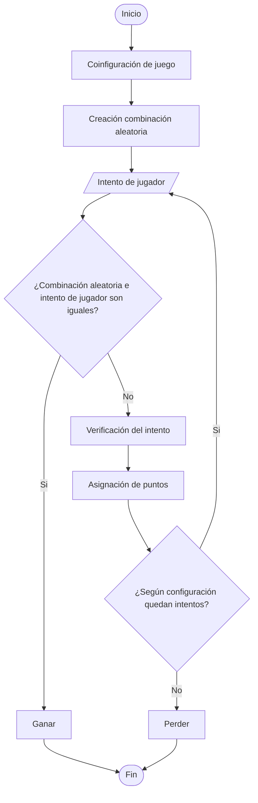

# **R4nd.M1n1ng**
***
## Un proyecto de Cobra Kode

## Introduccion 
El siguiente repositorio descrbe el desarrollo e implementacion de **R4nd.M1n1ng**, un juego el cual consiste en la generacion y adivinanza de una serie de caracteres aleatorios. El objetivo es que el usuario descubra la secuencia ocualta mediante intentos sucesivos y un sistema de puntuacion.
## Diagramas de flujo preliminares:
# Diagrama general:

# Diagrama expandido: 

```mermaid
flowchart TD
    A(["Inicio"]) --> n17@{ label: "<span style=\"font-family:\">Generar e inicializar variables: *caracteres*, *intentos_cuenta* y *puntos* en 0</span>" }
    C{"Escoger tipo de caracteres"} -- Numeros --> C1["Asignar valor: *Numeros* a llave: Tipo en *configuracion*"]
    C -- Letras --> C2["Asignar valor: *Letras* a llave: Tipo en *configuracion*"]
    C -- Ambos --> C3["Asignar valor: *Numeros y Letras* a llave: Tipo en *configuracion*"]
    C1 --> n27["Asignar valor: *No* a llave: Capitalizacion en *configuracion*"]
    C2 --> D{"Escoger capitalización de letras"}
    D -- "<span style=background-color:>Mayúsculas</span>" --> D1["Asignar valor: *Minusculas* a llave: Capitalizacion en *configuracion*"]
    D -- "<span style=background-color:>Minúsculas</span>" --> D2["Asignar valor: *Mayusculas* a llave: Capitalizacion en *configuracion*"]
    D -- Ambas --> D3["Asignar valor: *Mayusculas y Minusculas* a llave: Capitalizacion en *configuracion*"]
    C3 --> D
    D1 --> E{"¿Permitir repeticiones?"}
    D2 --> E
    D3 --> E
    E -- No --> E1["Asignar valor: *No* a llave: Repeticion en *configuracion*"]
    E -- Si --> E2["Asignar valor: *Si* a llave: Repeticion en *configuracion*"]
    E1 --> F["Usuario ingresa cantidad de caracteres"]
    E2 --> F
    F --> F7["Guardar numero en *caracteres*"]
    F7 --> F8["¿*caracteres* esta entre 3 y 10 (inclusivo)?"]
    G{"Escoger cantidad de intentos"} -- 3 --> G1["Asignar valor: *3* a llave: Vidas en *configuracion*"]
    G -- 5 --> G2["Asignar valor: *5* a llave: Vidas en *configuracion*"]
    G -- 10 --> G3["Asignar valor: *10* a llave: Vidas&nbsp;en *configuracion*"]
    G -- Infinitos --> G4["Asignar valor: *Infinitos* a llave: Vidas&nbsp;en *configuracion*"]
    G1 --> H["Generar string con una combinación aleatoria según la confuguración de juego"]
    G2 --> H
    G3 --> H
    I["Usuario intenta adivinar"] --> n9["Guardar intento en variable: *usuario*"]
    K{"¿Elemento tiene el mismo indice que el elemento correspondiente en *usuario_lista*?"} -- Si --> L["Sumar 1 a *puntos*"]
    L --> n22["Agregar elemento a *correcto_posicion*"]
    N{"¿*intentos_cuenta* es igual al valor de llave: Vidas&nbsp;en *configuracion*?"} -- No --> I
    N -- Si --> O["Perder"]
    O --> P["Mostrar en pantalla *configuracion*, *puntos*"]
    Q["Ganar"] --> P
    n1["Generar lista vacia: *respuesta_lista*"] -- Si --> n2["Repetir por cada caracter de *respuesta*"]
    H --> n11["Guardar combinación en variable: *respuesta*"]
    n2 --> n3["Añadir a *respuesta_lista*"]
    n3 --> n4["¿Quedan caracteres en el string?"]
    n4 -- No --> I
    n4 -- Si --> n2
    n6["Repetir por cada caracter de *usuario*"] --> n7["Añadir a *usuario_lista*"]
    n5["Generar lista vacia: *usuario_lista*"] --> n6
    n7 --> n8["¿Quedan caracteres en el string?"]
    n8 -- Si --> n6
    n8 -- No --> J["¿*respuesta_lista* y *ususario_lista* tienen la misma cantidad de elementos?"]
    n9 -- Convertir string a lista --> n5
    n11 -- Convertir string a lista --> n1
    J -- No --> n12["Restar 1 a *puntos*"]
    n12 --> n44["Pedir al usuario que ingrese nuevamente el intento"]
    n15["Repetir por cada elemento en *usuario_lista*"] --> n31@{ label: "<span style=\"font-family:\">¿En *configuracion*,&nbsp;</span>llave: Capitalizacion el valor es <span style=\"font-family:\">*Mayusculas y Minusculas*?</span><span style=\"font-family:\">&nbsp;</span>" }
    n16["¿El elemento esta en *respuesta_lista*?"] -- No --> n15
    n16 -- Si --> n18["Sumar 1 a *puntos*"]
    n17 --> n23@{ label: "Generar listas vacias: *incorrecto_capi*, *correcto_aparicion* y *<span style=\"font-family:\">correcto_posicion*</span>" }
    n18 --> n21["Agregar elemento a *correcto_aparicion*"]
    n19["¿Quedan elementos en la lista?"] -- Si --> n15
    K -- No --> n19
    n22 --> n19
    n21 --> K
    n23 -- "<span style=font-family:>Configuración de juego</span>" --> n24@{ label: "Generar diccionario: *configuracion*. Llaves: Tipo, Capitalizacion, Repeticion, Cantidad, Vidas.&nbsp;<span style=\"font-family:\">(Valores vacios)</span>" }
    n24 --> C
    n25["Mostrar en pantalla *correcto_aparicion*, *correcto_posicion* y *puntos*"] --> N & n39["¿*incorrectos_capi* esta vacio?"]
    J -- Si --> n26["¿*respuesta_lista* y *ususario_lista* son iguales?"]
    n26 -- No --> n15
    n26 -- Si --> Q
    n27 --> E
    F8 -- No --> n28["Pedir al usuario que ingrese nuevamente la cantidad de caracteres"]
    n28 --> F
    n19 -- No --> n30["Sumar 1 a *intentos_cuenta*"]
    n30 --> n25
    G4 --> H
    n31 -- Si --> n32["¿El elemento es una letra?"]
    n32 -- Si --> n33["¿El elemento esta en *respuesta_lista* como mayúscula o minúscula?"]
    n33 -- Si --> n34["Sumar 1 a *puntos*"]
    n34 --> n35["Agregar elemento a *correcto_aparicion*"]
    n36["¿La capitalización del elemento coincide con su respectivo en *respuesta_lista*?"] -- Si --> n37["Sumar 1 a *puntos*"]
    n35 --> n36
    n36 -- No --> n38["Agrear elemento a *incorrecto_capi*"]
    n31 -- No --> n16
    n37 --> K
    n38 --> K
    n39 -- No --> n40["Mostrar *incorrectos_capi*"]
    n40 --> N
    n39 -- Si --> N
    n32 -- No --> n16
    n33 -- No --> n15
    P --> n42@{ label: "<span style=\"--tw-border-spacing-x:\">¿En *configuracion*,&nbsp;</span>llave: Vidas, el valor es&nbsp;<span style=\"--tw-border-spacing-x:\">*Infinitos*?</span><span style=\"--tw-border-spacing-x:\">&nbsp;</span>" }
    n42 -- Si --> n43["Mostrar en pantalla *intentos_cuenta*"]
    n43 --> n41(["Fin"])
    n42 -- No --> n41
    n44 --> I
    F8 -- Si --> n45["Asignar valor de caracteres a llave: Cantidad en *configuracion*"]
    n45 --> G

    n17@{ shape: rect}
    F@{ shape: lean-r}
    F8@{ shape: diam}
    I@{ shape: lean-r}
    n9@{ shape: rect}
    n1@{ shape: rect}
    n2@{ shape: rect}
    n11@{ shape: rect}
    n4@{ shape: diam}
    n6@{ shape: rect}
    n7@{ shape: rect}
    n5@{ shape: rect}
    n8@{ shape: diam}
    J@{ shape: diam}
    n31@{ shape: diam}
    n16@{ shape: diam}
    n23@{ shape: rect}
    n19@{ shape: diam}
    n24@{ shape: rect}
    n39@{ shape: diam}
    n26@{ shape: diam}
    n32@{ shape: diam}
    n33@{ shape: diam}
    n34@{ shape: rect}
    n35@{ shape: rect}
    n36@{ shape: diam}
    n42@{ shape: diam}
```

## Código preliminar 
```python
import random
import string

configuracion = {
    "Tipo" : "",
    "Capitalizacion" : "",
    "Repeticion" : "",
    "Cantidad" : "",
    "Vidas" : ""
}

def combinacion_aleatorea(configuracion:dict, lon:int):
    opciones = []
    mayus = string.ascii_uppercase # Mayusculas
    minus = string.ascii_lowercase # Minusculas
    mayus_minus = string.ascii_letters # Ambas
    nume = string.digits # Numeros
    if configuracion["Tipo"] == "numeros" or configuracion["Tipo"] == "ambos":
        opciones.append(nume)
    else:
        pass

    if configuracion["Tipo"] == "letras" or configuracion["Tipo"] == "ambos":
        opciones.append(nume)
        match configuracion["Capitalizacion"]:
            case "mayusculas":
                opciones.append(mayus)
            case "minusculas":
                opciones.append(minus)
            case "ambas":
                opciones.append(mayus_minus)
    else:
        pass
    opciones_string = "".join(opciones)

    if configuracion["Repeticion"] == "no":
        cadena = "".join(random.sample(opciones_string, lon))
    else:
        cadena = "".join(random.choices(opciones_string, lon))
    
    respuesta_lista = []
    for i in range(len(cadena)):
        respuesta_lista.append(i)
    return respuesta_lista
```
---
## Colaboradores:
* Juan Manuel Dávila Dominguez
* Zaida Alejandra Guzman Martínez
* Laura Mariana de Jesús García Garnica
***
# Referencias
* https://labex.io/es/tutorials/python-how-to-implement-time-delays-in-python-420943
* https://www.geeksforgeeks.org/how-to-add-time-delay-in-python/
* https://www.reddit.com/r/learnpython/comments/qa1g75/how_to_print_one_character_at_a_time_slowly_in/?rdt=52729
