# **R4nd.M1n1ng**
***
## Un proyecto de Cobra Kode

## Introduccion 
El siguiente repositorio describe el desarrollo e implementación de **R4nd.M1n1ng**, un juego que consiste en la generación y adivinanza de una serie de caracteres aleatorios. El objetivo es que el usuario descubra la secuencia oculta mediante intentos sucesivos y un sistema de puntuación.
***
## Cómo se abordó el problema
Se desarrolló el código del juego con una estructura de funciones específicas. A continuación, se presenta cada una de ellas y su propósito dentro del juego: 

### Funciones de utilidades 
*-cargando (text: str):*

Simula un efecto de carga al imprimir caracteres con un breve retraso.
```python
def cargando(text: str):
    for i in text: 
        print(i, end="") 
        time.sleep(0.2) 
```
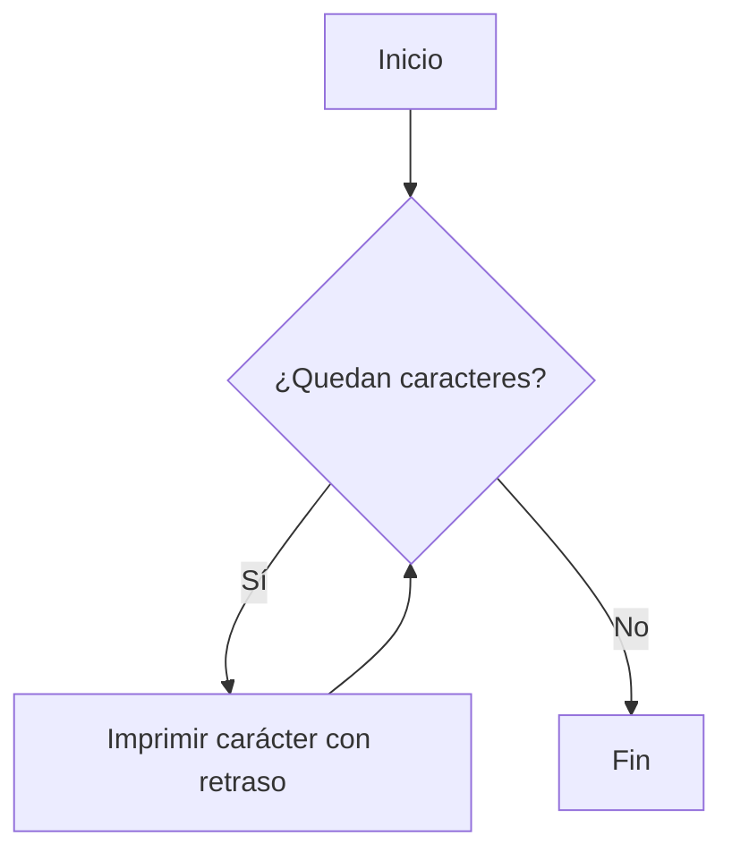
*-strToList(secuencia: str) -> list*

Convierte un string en una lista de caracteres para facilitar el análisis de datos.
```python
def strToList (secuencia : str) -> list:
    return list(secuencia) 
```
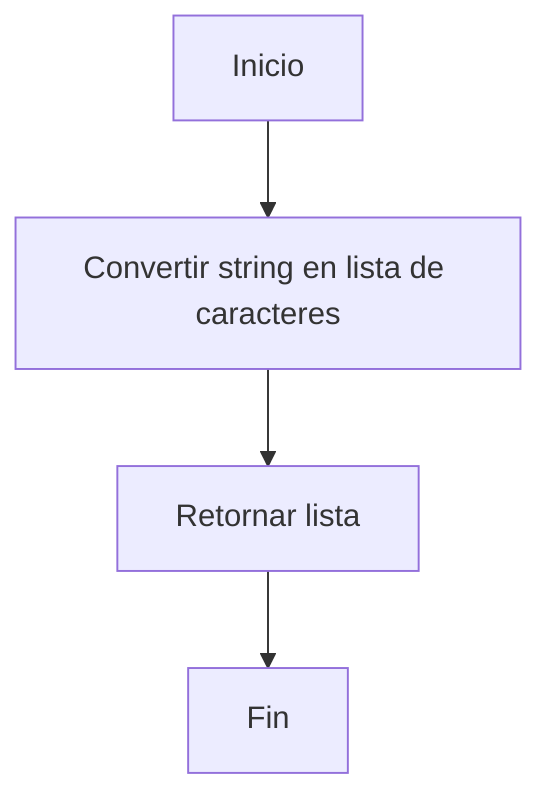
### Funciones de validación y comparación 
*-compareLengths(listR: list, listU: list) -> int*

Compara la longitud de la respuesta del usuario con respecto a la lista generada por el sistema, y si no coinciden, penaliza al usuario.
```python
def compareLengths (listR, listU : list) -> int:
    score : int = 0
    if len(listR) == len(listU):
        score = 0
        print("LGFG!!! Son del mismo largo (づ ◕‿◕ )づ")
    elif len(listR) > len(listU):
        score = -1
        print("Tch!!! la secuencia es mas larga de lo que ingresaste")
        time.sleep(2)
        print("¿No recuerdas como configuraste la partida? (乛-乛)")
        time.sleep(2)
        cargando("(-1) punto, por atembao") 
    else: 
        score = -1
        print("Tch!!! la secuencia es mas corta de lo que ingresaste")
        time.sleep(2)
        print("¿No recuerdas como configuraste la partida? (乛-乛)")
        time.sleep(2)
        cargando("(-1) punto, por atembao") 
    return score
```
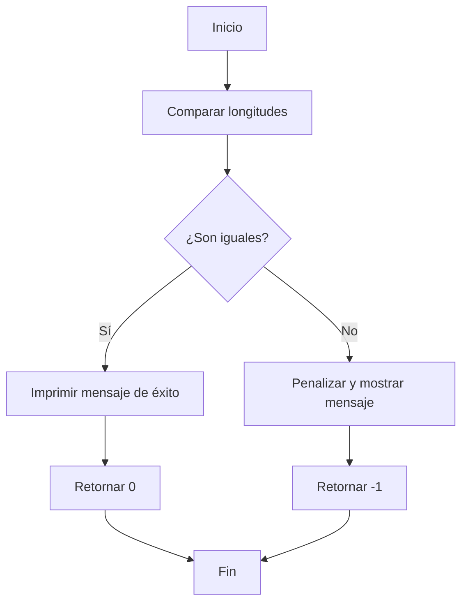
*-compareCapnoCap(listR: list, listU: list) -> tuple[int, bool]*

Esta función identifica los caracteres con capitalización correcta en la respuesta del usuario en comparación con la secuencia oculta y otorga los respectivos puntos.

```python
def compareCapnoCap (listR: list, listU : list) -> tuple[int, bool]:
    score : int = 0
    capU : list = []
    noCapU : list = []
    flagT : tuple = []
    for i in listU:
        if i.isalpha() and i.isupper():  # Verificar si el carácter es alfabético y mayúscula
            capU.append(i)
        elif i.isalpha() and i.islower():  # Verificar si el carácter es alfabético y minúscula
            noCapU.append(i) 
    for i in listR:
        if i in capU and i in noCapU:
            score += 2
            flagT.append(True) 
            time.sleep(2)
            print (f"Oh! parece que {i} si se encuentra en la lista tanto en mayuscula como minuscula")
            print ("Un piko por inteliegente ( ˘ ³˘)♥")
            print ("(+2) puntos")
        elif i in capU and i not in noCapU:
            score += 1
            flagT.append(False) 
            time.sleep(2)
            print (f"Oh! parece que {i} si se encuentra en la lista en mayuscula pero no en minuscula")
            print ("A la proxima hazlo mejor, ok? (˶ ⚈ Ɛ ⚈ ˵)")
            print ("(+1) punto")
        elif i not in capU and i in noCapU:
            score += 1
            flagT.append(False) 
            time.sleep(2)
            print (f"Oh! parece que {i} si se encuentra en la lista en minuscula pero no en mayuscula")
            print ("A la proxima hazlo mejor, ok? (˶ ⚈ Ɛ ⚈ ˵)")
            print ("(+1) punto")
        else:  
            time.sleep(2)
            cargando ("Ah dale, obvio, claro, claro (•ิ _•ิ )...")  
    if all.flagT() == True:
        flag = True 
    else:
        flag = False 
    return score, flag
```
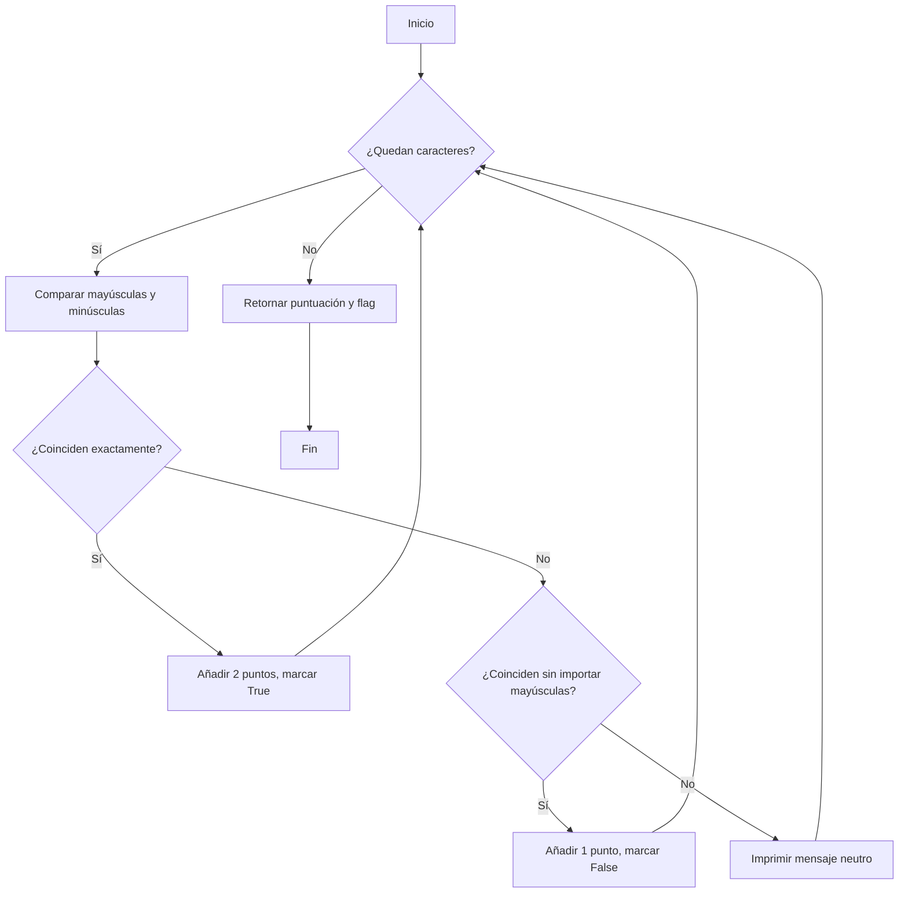
*-compare_index(user_chain: str, org_chain: str, score: int) -> tuple[int, bool]*

Esta función identifica los caracteres que coinciden en posición en ambas listas. 

```python
def compare_index(user_chain:str, org_chain:str, score:int) -> tuple [int, bool]:
    both_index = []
    bot = zip(org_chain, user_chain)
    both = list(bot)
    for org, user in both:
        if org == user:
            both_index.append(user)
        else:
            pass 

    match len(both_index):
        case 0:
            print("¿Que paso bb? ninguna esta en la posicion correcta ╥﹏╥")
        case 1:
            score += 1
            print (f"Parece que {str(both_index)} esta en la posicion correcta!!")
            print ("+ (1) punto")
        case _:
            for _ in both_index:
                score += 1
            print (f"Parece que {str(both_index)} estan en la posicion correcta!!")
            print ("Que pilo eres ᕙ( ͡❛ ͜ʖ ͡❛)ᕗ")
            print (f"+ ({len(both_index)}) puntos")
    return score, flag
```
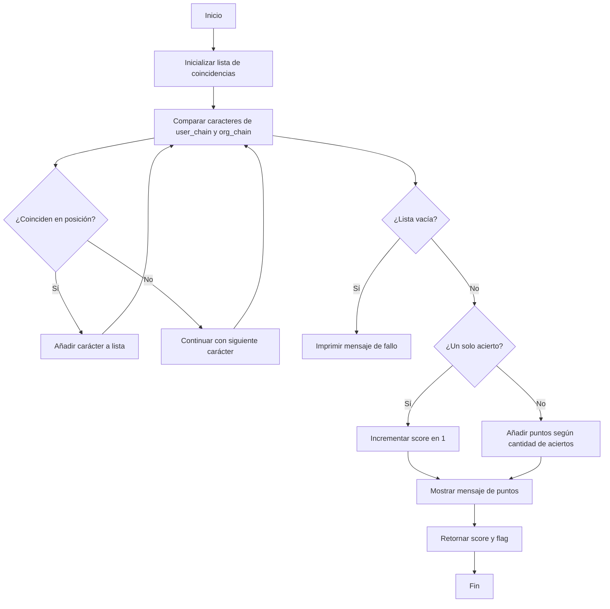
*-compare_exist(user_chain: str, org_chain: str, score: int) -> tuple[int, bool]*

Evalúa qué caracteres de la entrada del usuario están presentes en la cadena correcta, sin importar la posición. 

```python
def compare_exist(user_chain:str, org_chain:str, score:int) -> tuple[int, bool]:
    in_both = []
    for char in user_chain:
        if char in org_chain:
            in_both.append(char)
        else:
            pass

    match len(in_both):
        case 0:
            print("¿Que paso bb? ninguna esta en la posicion correcta ╥﹏╥")
        case 1:
            score += 1
            print (f"Parece que {str(in_both)} esta en la cadena!!")
            print ("+ (1) punto")
        case _:
            for _ in in_both:
                score += 1
            print (f"Parece que {str(in_both)} estan en la cadena!!")
            print ("Que pilo eres ᕙ( ͡❛ ͜ʖ ͡❛)ᕗ")
            print (f"+ ({len(in_both)}) puntos")
    return score, flag 
```
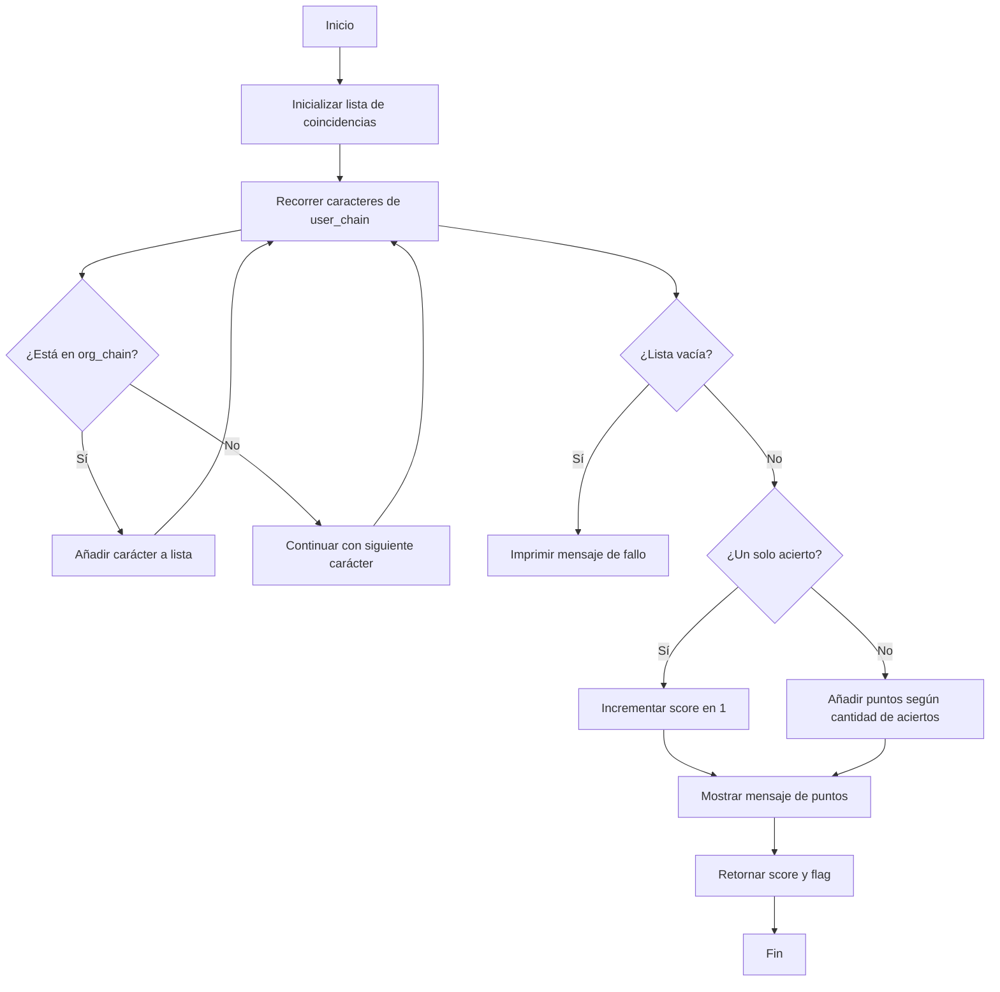
### Funciones del juego 
*-history(name: str, score: int) -> dict*

Registra el nombre del jugador y su puntaje en un diccionario.
```python
    def history(name:str, score:int) -> dict:
    user_tries = []
    partida = {
        "Nombre" : name,
        "Puntaje" : score
    }
    user_tries.append(partida)
    sorted(user_tries, reversed= True)

    rank : int = 1
    for dic in user_tries:
        dic["rank"] = rank
        rank += 1

    user_tries_tab = tabulate(user_tries, headers= "keys", tablefmt= "grid")
    return user_tries_tab
```
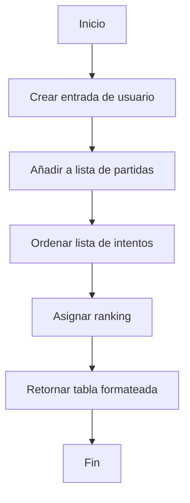
*game_start(configuration: dict)*

Maneja el flujo principal del juego, asegurando que se sigan las reglas configuradas.
```python
    def game_start(configuration:dict):
    if configuration.get("Lifes") == "infinitos":
        match configuration.values():
            case {"Data": "letras", "Repetition": "si", "Capital": "ambas"}:
                while win == False:
                    tuplaCapnoCap = compareCapnoCap(l_original, l_user)
                    score += tuplaCapnoCap[0]
                    flagCap = tuplaCapnoCap[1]
            case {"Data": "letras", "Repetition": "no", "Capital": "ambas"}:
                while win == False:
                    tuplaCapnoCap = compareCapnoCap(l_original, l_user)
                    score += tuplaCapnoCap[0]
                    flagCap = tuplaCapnoCap[1]

    if configuration.get("Lifes") in {3, 5, 10}:
        match configuration.values():
            case {"Data": "letras", "Repetition": "si", "Capital": "ambas"}:
                lifes = configuration.get("Lifes")
                for _ in range(lifes):
                    tuplaCapnoCap = compareCapnoCap(l_original, l_user)
                    score += tuplaCapnoCap[0]
                    flagCap = tuplaCapnoCap[1]
            case {"Data": "letras", "Repetition": "no", "Capital": "ambas"}:
                xxx
        if win == True:
            history(name, score)
```
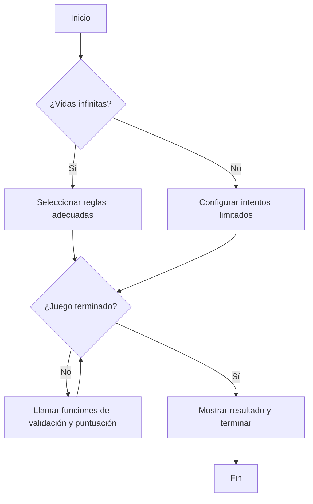
*-validar_entrada(usuario_input: str, configuration: dict) -> bool*

Esta función se asegura de que en la respuesta del usuario solo haya caracteres permitidos por la configuración.
```python
    allowed_characters = ""
    if configuration["Data"] == "letras" or configuration["Data"] == "ambos":
        if configuration["Capital"] == "mayusculas":
            allowed_characters += string.ascii_uppercase
        elif configuration["Capital"] == "minusculas":
            allowed_characters += string.ascii_lowercase
        elif configuration["Capital"] == "ambas":
            allowed_characters += string.ascii_letters

    if configuration["Data"] == "numeros" or configuration["Data"] == "ambos":
        allowed_characters += string.digits

    if all(char in allowed_characters for char in usuario_input) == False : 
        validacion : bool = False
        cargando (". . .")
        print ("Mmm... \n")
        print ("¿No recuerdas como configuraste la partida?(ﾉಠдಠ)ﾉ︵┻━┻")
    else:
        validacion : bool = True
        cargando ("♥°˖✧°˖✧°˖✧°˖✧°˖✧◝(⁰▿⁰)◜✧˖°✧˖°✧˖°✧˖°♥")
    return validacion 
```
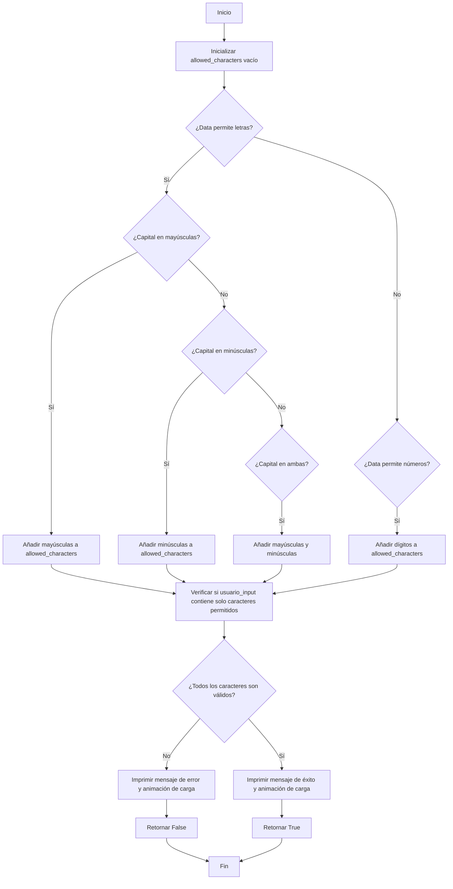
*-configuration_game(configuration: dict) -> dict*

Pide al usuario definir los parámetros con los que va a jugar, como el tipo de carácter, mayúsculas/minúsculas, repetición de caracteres, etc.
```python
def configuration_game(configuration:dict) -> dict: 
    while True:
        data_value = input("    1- Tipo de caracteres (letras, numeros, ambos): ")
        if data_value in {"letras", "numeros", "ambos"}:
            configuration["Data"] = data_value
            break
        else:
            print("No esta dentro de las opciones (⩺_⩹)")

    if configuration["Data"] == "letras" or configuration["Data"] == "ambos":
        while True:
            capital_value = input("    2- Capitalizacion de letras (mayusculas, minusculas, ambas): ")
            if capital_value in {"mayusculas", "minusculas", "ambas"}:
                configuration["Capital"] = capital_value
                break
            else:
                print("No esta dentro de las opciones (⩺_⩹)")
    else:
        pass
    
    while True:
        repetition_value = input("    3- Repetición de caracteres (si, no): ")
        if repetition_value == "si" or repetition_value == "no":
            configuration["Repetition"] = repetition_value
            break
        else:
            print("ಠ_ʖಠ ... si o no")
    
    while True:
        amount_value = int(input("    4- Cantidad de caracteres (3-10): "))
        if amount_value >= 3 and amount_value <= 10:
            configuration["Amount"] = amount_value
            break
        else:
            print("Puedes usar 3, 4, 5, 6 ... ಠ_ʖಠ ... 7, 8, 9, 10")

    while True:
        lifes_value = input("    5- Intentos (3, 5, 10, infinitos): ")
        if lifes_value in {3, 5, 10} or lifes_value :
            if lifes_value == "infinitos": 
                lifes_value = float('inf')
            else: 
                lifes_value = int(lifes_value)
            configuration["Lifes"] = lifes_value
            break
        else:
            print("Opcion NO disponible -(`෴´)- ")

    configuration_tab = tabulate(configuration.items(), tablefmt= "grid")

    return configuration_tab
```
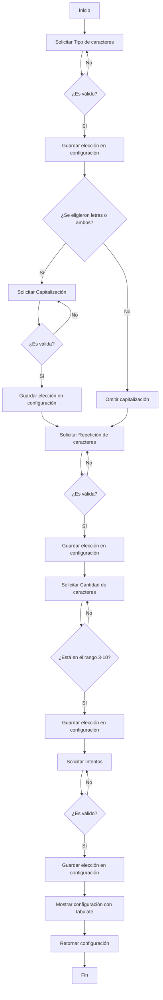
*-combinacion_aleatorea(configuration: dict) -> list*

Genera una cadena aleatoria basada en la configuración establecida.
```python
def combinacion_aleatorea(configuration:dict) -> list: 
    options = [] 
    mayus = string.ascii_uppercase # Mayusculas
    minus = string.ascii_lowercase # Minusculas
    mayus_minus = string.ascii_letters # Ambas
    nume = string.digits # Numeros

    if configuration["Data"] == "letras" or configuration["Data"] == "ambos":
        match configuration["Capital"]:
            case "mayusculas":
                options.append(mayus)
            case "minusculas":
                options.append(minus)
            case "ambas":
                options.append(mayus_minus)

    if configuration["Data"] == "numeros" or configuration["Data"] == "ambos":
        options.append(nume)
    
    options_string = "".join(options)
    lon = configuration["Amount"]

    # Generar cadena aleatoria
    if configuration["Repetition"] == "no":
        chain = "".join(random.sample(options_string, lon))
    else:
        chain = "".join(random.choices(options_string, k = lon))
 
    chain_list = []
    for elem in chain:
        chain_list.append(elem)

    return chain_list
```
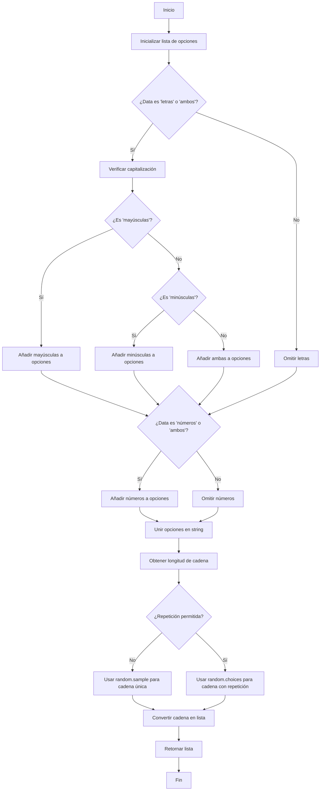
***
---
## Instalación de R4nd.M1n1ng

Sigue estos pasos para instalar y ejecutar el juego en tu sistema.

###  Requisitos Previos

Antes de comenzar, asegúrate de tener instalado:

- *Python 3.8 o superior* 
  Puedes descargarlo desde [python.org](https://www.python.org/downloads/).

- *Pip (gestor de paquetes de Python)* 
  Para verificar si lo tienes instalado, ejecuta:  
  ```bash
  pip --version
  ```
### Instalación 
1. Clona el repositorio o descarga el código fuente.
 ```bash
 git clone https://github.com/tu-usuario/R4nd.M1n1ng.git
 cd R4nd.M1n1ng
 ```
2. Instala las dependencias necesarias.

### Ejecución 
Para iniciar el juego, usa el siguiente comando dentro del directorio del proyecto: 
```bash
- python main.py
```
***
## Colaboradores:
* Juan Manuel Dávila Dominguez
* Zaida Alejandra Guzman Martínez
* Laura Mariana de Jesús García Garnica
***
## Referencias
* https://labex.io/es/tutorials/python-how-to-implement-time-delays-in-python-420943
* https://www.geeksforgeeks.org/how-to-add-time-delay-in-python/
* https://www.reddit.com/r/learnpython/comments/qa1g75/how_to_print_one_character_at_a_time_slowly_in/?rdt=52729
